# Lightrider: Virtual Relativistic Flight

Lightrider is a Javascript based web application that shows a virtual flight with relativistic speed, e.g. it demonstrates how the buildings and the horizon will look like for an observer that moves with relativistic speed. It also shows the color transformations caused by the relativistic Doppler effect: objects that move towards the observer are blue shifted, objects that move away from the observer are red shifted.

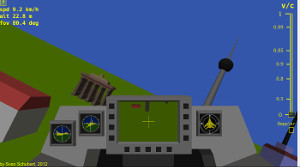 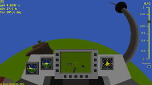 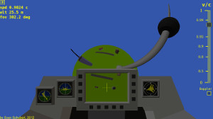 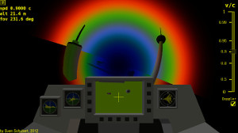

The 3D graphics are rendered with the help of [three.js](https://threejs.org/) and [WebGL](https://www.khronos.org/webgl/). The relativistic geometry transformations (boosts) are calculated by the vertex shaders whereas the shift of the optical wavelengths, also known as the relativistic Doppler effect, is calculated by the fragment shaders.

## Installation

Before continuing, make sure you have [Docker CE](https://docs.docker.com/install/) and [Docker Compose](https://docs.docker.com/compose/install/) installed. If installed, you can build the Docker image of the web application by going to the folder `dev` and calling

```script
make website
```

As a first step during the build process the Docker image of the build enviroment will be built. The build environment contains Python 2 with some packages for numeric computations, Node.js and Saxon HE for Javascript and XML/XSLT transformations.
Most of the build commands found in the Makefile will be executed inside this build environment in order to generate the minified Javascript code and all other resource files.
Finally the Docker image of the web application will be built. This image contains an Apache 2 web server with PHP 5 and Symfony 2.3.

After successfully build, go to the folder `website` and type

```script
docker-compose up -d
```

This command will start the Apache 2 web server within a Docker container. When the container is running, you can open a web browser at http://localhost:8081.

## How to use it

With the **arrow keys** the plane can be rotated. Press **a** or **d** to yaw, **w** to accelerate and **s** to decelerate. To change the relativistic speed (*&beta; = v/c*) you can move the vertical slider on the right hand side up and down or use the mouse wheel.
By default the relativistic Doppler effect is deactivated. It can be turned on and off using a checkbox below the vertical slider bar for the relativistic speed. If you have marked the checkbox, on the left hand side of this checkbox a horizontal slider will show up with which you can change the strength of the relativistic Doppler effect.

You can set the relativistic speed independently of the speed you are moving around within the scene. To understand this behaviour you have to imagine that you move around a camera and make snapshots while the camera itself moves along the viewing direction with relativistic speed.
 
## Physics

All you need to be able to understand how virtual reality has to be modified if Special Relativity comes into play is equation

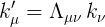

with the wave four-vector

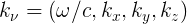

which describes a light ray with &omega; the angular frequency of the light and *(k<sub>x</sub>, k<sub>y</sub>, k<sub>z</sub>)* the three dimensional wave vector that points into the direction of the light ray and the boost matrix

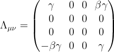

where *&beta; = v/c* and

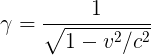

If an object of a scene, e.g. a building emits or reflects a light ray, this light ray can be described by the wave four-vector *k<sub>&nu;</sub>*. If an observer moves along the *z*-axis at constant speed *v*, according to Special Relativity the light ray received by the observer will not be described anymore by the same vector *k<sub>&nu;</sub>* but by the transformed wave four-vector *k'<sub>&mu;</sub>*. 

#### Aberration of the Light Ray

The first result of the transformation of the wave four vector *k<sub>&nu;</sub>* is the aberration of the light ray as described by the following equation

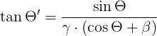

with *&Theta;* the angle between the *z*-axis and the light ray emitted by the object within the scene and *&Theta;'* the angle between the same light ray and the *z*-axis as received by the moving observer. It means that for a moving observer a light ray emitted from the scene seems to come from a direction more in front of him than it really does because the angle *&Theta;'* within the observers frame is always smaller than the angle *&Theta;* within the scene. Effectively the field of view (FOV) of the observer grows with increasing speed. At high enough speed the observer can see objects in front of him moving towards him that in fact are behind him and move away from the observer. In other words: Special Relativity provides the moving observer with a speed dependent wide-angle lens. At the speed of light the field of view would cover *360°*. In that case the observer could see the whole scene in front of him shrinked to a point. 

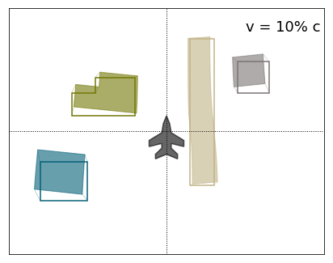

The figure above shows the top view of a scene with some buildings and a runway and how the observer at the center of the scene would interprete the scene at different speeds *v*, taking into account that the human brain is not used to relativistic speeds and hence would try to reconstruct the three dimensional scene spoiled by its non-relativistic experience.

#### Relativistic Doppler Effect

The second result of the transformation of the wave four-vector *k &rarr; k'* is the relativistic Doppler effect

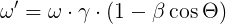
 
which means that the observer receives the light ray with a shifted wave length: light emitted by objects towards which the observer moves, is blue shifted. Light emitted by objects from which the observer moves away, is red shifted. 
 
Since the relativistic Doppler effect operates on wave lengths or wave length distributions but in computer graphics colors are usually represented as RGB values, any RGB value has to be converted into a wave length distribution before calculating the wave length shift according to the Doppler effect. After that the shifted wave length distribution has to be converted back into the corresponding RGB value.

Given a wave length distribution *f(&lambda;)* that describes a color value emitted somewhere in the scene, the corresponding RGB values can be calculated with the help of the integrals

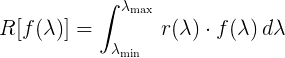

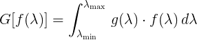

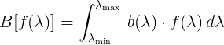

with *r(&lambda;)*, *g(&lambda;)* and *b(&lambda;)* the so-called [color matching functions](http://en.wikipedia.org/wiki/CIE_1931_color_space" target="_blank">http://en.wikipedia.org/wiki/CIE_1931_color_space) measured for the red, green and blue receptor cells of the human eye according to the following figure:

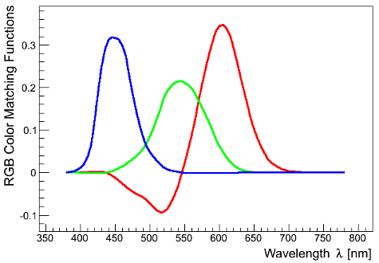

With appropriate base functions for the wave length distributions the reverse transformations can be derived with good approximation. All this, the transformation from an RGB value into a wave length distribution, the shift of the wave lengths and the transformation back from the shifted wave length distribution to the shifted RGB value would have to be done for each pixel. Although the Doppler effect is calculated by the fragment shaders, even if you are a lucky owner of a graphics card with thousands of shaders this calculation would be far too time consuming for a real time application.

Fortunately most of the calculation can be moved into to a script that runs only once when building the web application. This script calculates the Doppler map which is a special texture that encodes the static part of the Doppler effect. With this Doppler map the whole calculation of the wave length shift for each pixel reduces to a simple texture lookup at which fragment shaders are usually very good.

## References

* [OpenGL Specifications by Khronos Group](http://www.khronos.org/opengl)
* [WebGL/OpenGL ES 2.0 Specifications by Khronos Group](http://www.khronos.org/webgl/)
* [The three.js 3D-library for Javascript and WebGL](http://mrdoob.github.com/three.js/)
* [Virtual Relativity Project, University of Stuttgart](http://cumbia.informatik.uni-stuttgart.de/ger/research/fields/current/relativity/specialrelativity/vr/vr-ger.html">http://cumbia.informatik.uni-stuttgart.de/ger/research/fields/current/relativity/specialrelativity/vr/vr-ger.html)
* [Color Matching Functions and CIE 1931 Color Space](http://en.wikipedia.org/wiki/CIE_1931_color_space)

